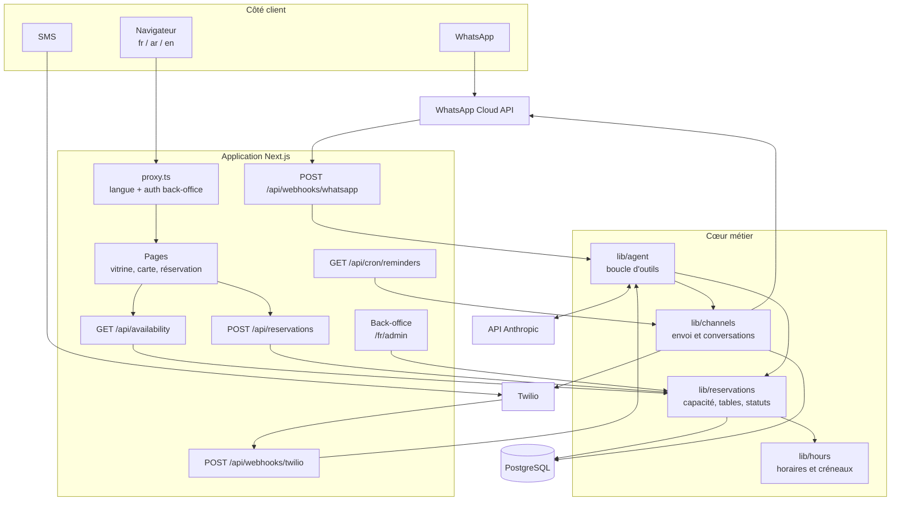

# Zanzibar Lounge

Site vitrine trilingue et système de réservation pour le Zanzibar Lounge, café-restaurant
à Medjez el Bab (Béja, Tunisie). Les clients réservent depuis le site ou en écrivant sur
WhatsApp ou par SMS : un agent conversationnel prend, retrouve, déplace et annule les
tables 24 h/24, sur les mêmes règles de capacité que le formulaire en ligne.

> **État du dépôt** — le code est complet et compile ; le contenu ne l'est pas.
> Les horaires, la carte, les numéros de téléphone et le plan de salle sont des
> valeurs d'exemple, signalées « À CONFIRMER » dans `src/content/site.ts`. À remplacer
> avant toute mise en ligne (voir [Limites](#limites-et-suite)).

---

## Fonctionnalités

**Pour le client**

- Consulter la carte, les horaires, l'adresse et les zones de salle en français, arabe
  ou anglais — l'arabe passe le site en lecture de droite à gauche.
- Voir d'un coup d'œil si l'établissement est ouvert **maintenant**, et jusqu'à quelle heure.
- Réserver une table en ligne : la date et l'effectif filtrent les créneaux réellement
  disponibles, pas une grille théorique.
- Réserver en écrivant sur WhatsApp ou par SMS, à n'importe quelle heure.
- Retrouver, déplacer ou annuler sa réservation dans la même conversation.
- Recevoir la confirmation puis un rappel, et répondre « OUI » ou « NON » pour confirmer
  sa venue.
- Se désabonner à tout moment en écrivant « STOP ».

**Pour la salle**

- Le service du soir sur une page : arrivées par heure, effectif, table, notes du client.
- Installer un client, libérer une table, marquer une absence, annuler.
- Compteur de couverts et de réservations pour la journée.
- Signalement des messages que l'agent a préféré transmettre à un humain.

**Garde-fous intégrés**

- Une réservation n'est acceptée que dans les horaires, avec le préavis minimum et dans
  la limite de couverts par créneau — le site et l'agent appliquent les mêmes règles.
- Deux réservations simultanées sur le dernier créneau ne peuvent pas passer toutes les
  deux (transaction sérialisable).
- L'agent ne peut lire ou modifier que les réservations du numéro qui lui écrit.

## Pile technique

| Technologie | Rôle |
|---|---|
| **Next.js 16** (App Router, Turbopack) | Rendu des pages, routes d'API, proxy de langue et d'authentification |
| **React 19** | Interface ; le formulaire de réservation est le seul composant client |
| **TypeScript 5** | Typage de bout en bout, y compris les dictionnaires de traduction |
| **Tailwind CSS 4** | Styles, avec la palette et la typographie déclarées en `@theme` |
| **Prisma 7** + **PostgreSQL** | Schéma, migrations et accès base via l'adaptateur `@prisma/adapter-pg` |
| **SDK Anthropic** (`claude-opus-5`) | Agent conversationnel avec appel d'outils |
| **WhatsApp Cloud API** (Meta) | Canal WhatsApp entrant et sortant |
| **Twilio** | Canal SMS entrant et sortant |
| **Zod 4** | Validation des entrées d'API et des variables d'environnement |
| **Vitest** | Tests unitaires de la logique horaires / fuseau / téléphone |

## Architecture



Le point important : **le formulaire du site et l'agent conversationnel n'ont pas deux
logiques de réservation, mais une seule** (`src/lib/reservations.ts`). L'agent ne dispose
que d'outils qui passent par elle ; il ne peut donc pas promettre une table que le site
refuserait.

## Structure du projet

```
prisma/
  schema.prisma        Modèles : clients, tables, réservations, conversations
  seed.mjs             Plan de salle initial (à ajuster au vrai plan)
src/
  app/
    [locale]/          Pages localisées — la racine de l'application
      admin/           Back-office : service du jour, actions serveur
      carte/ galerie/ reserver/
    api/
      availability/    Créneaux libres d'une date
      reservations/    Création depuis le site
      webhooks/        Entrées WhatsApp (Meta) et SMS (Twilio)
      cron/reminders/  Rappels J-1 et H-2
  components/          En-tête, pied de page, carte, formulaire, badge d'ouverture
  content/             Établissement, carte, galerie — la source de vérité éditoriale
  i18n/                Configuration des langues et dictionnaires fr / ar / en
  lib/
    *.test.ts          Tests des horaires, du fuseau et des numéros
    agent/             Prompt système et outils de l'agent
    channels/          WhatsApp, SMS, conversations, déduplication des webhooks
    hours.ts           Horaires, fenêtres de service, créneaux
    reservations.ts    Cœur métier : capacité, tables, statuts
    time.ts            Conversions de fuseau (Africa/Tunis) sans dépendance
  proxy.ts             Redirection de langue et authentification du back-office
```

## Installation

**Prérequis** — Node.js 20 ou plus récent (développé sous 24), npm 10+, et une base
PostgreSQL 14+ (Neon, Supabase ou locale).

```bash
git clone <url-du-depot> zanzibar.lounge
cd zanzibar.lounge
npm install          # génère aussi le client Prisma (script postinstall)
cp .env.example .env.local
```

Renseignez ensuite `.env.local` :

| Variable | Requis | Défaut | À quoi ça sert |
|---|---|---|---|
| `DATABASE_URL` | oui | — | Connexion applicative à PostgreSQL |
| `DIRECT_DATABASE_URL` | pour migrer | — | Connexion directe, sans pooler, utilisée par Prisma Migrate |
| `ANTHROPIC_API_KEY` | non | — | Sans elle, l'agent répond par un message de repli renvoyant au téléphone |
| `WHATSAPP_PHONE_NUMBER_ID` | pour WhatsApp | — | Numéro émetteur côté Meta |
| `WHATSAPP_ACCESS_TOKEN` | pour WhatsApp | — | Jeton d'accès de l'application Meta |
| `WHATSAPP_VERIFY_TOKEN` | pour WhatsApp | — | Jeton que vous choisissez, recopié dans la configuration du webhook |
| `WHATSAPP_APP_SECRET` | pour WhatsApp | — | Vérification de la signature `X-Hub-Signature-256` |
| `WHATSAPP_REMINDER_TEMPLATE` | non | — | Modèle approuvé pour les rappels ; sans lui, les rappels partent en SMS |
| `TWILIO_ACCOUNT_SID` | pour SMS | — | Compte Twilio |
| `TWILIO_AUTH_TOKEN` | pour SMS | — | Sert aussi à vérifier `X-Twilio-Signature` |
| `TWILIO_FROM` | pour SMS | — | Numéro expéditeur, ou Messaging Service (`MG…`) |
| `BOOKING_REQUIRE_OTP` | non | `false` | `true` exige un code à six chiffres avant toute réservation en ligne |
| `UPSTASH_REDIS_REST_URL` | recommandé en prod | — | Compteurs de limitation partagés entre instances |
| `UPSTASH_REDIS_REST_TOKEN` | recommandé en prod | — | Jeton du même service |
| `CRON_SECRET` | pour les rappels | — | Protège `/api/cron/reminders` (32 caractères minimum) |
| `ADMIN_USER` | pour le back-office | — | Identifiant HTTP Basic |
| `ADMIN_PASSWORD` | pour le back-office | — | Mot de passe HTTP Basic (16 caractères minimum) |
| `NEXT_PUBLIC_SITE_URL` | non | `http://localhost:3000` | URL publique ; sert à valider la signature Twilio |

Puis la base et le serveur :

```bash
npm run db:migrate     # crée le schéma
npm run db:seed        # plan de salle d'exemple (facultatif)
npm run dev            # http://localhost:3000 → redirige vers /fr
```

Le site fonctionne avec la seule `DATABASE_URL`. Les canaux non configurés se désactivent
proprement : le back-office affiche ce qui manque, et rien d'autre ne casse.

### Scripts

| Commande | Effet |
|---|---|
| `npm run dev` | Serveur de développement |
| `npm run build` | Compilation de production |
| `npm start` | Sert la compilation |
| `npm run lint` | ESLint |
| `npm run typecheck` | `tsc --noEmit` |
| `npm run db:migrate` | Crée et applique une migration en développement |
| `npm run db:deploy` | Applique les migrations en production |
| `npm run db:studio` | Explorateur de base Prisma |
| `npm run db:seed` | Insère le plan de salle (`prisma/seed.mjs`) |
| `npm test` | Suite de tests Vitest |
| `npm run test:watch` | Tests en continu |
| `npm run forget -- +216…` | Efface toutes les données d'une personne, sur sa demande |

### Brancher WhatsApp et les SMS

1. **WhatsApp** — dans la console Meta, déclarez le webhook sur
   `https://VOTRE-DOMAINE/api/webhooks/whatsapp` avec votre `WHATSAPP_VERIFY_TOKEN`, et
   abonnez-vous au champ `messages`. Meta appelle l'URL en `GET` une fois pour valider.
2. **SMS** — dans la console Twilio, pointez le webhook entrant du numéro sur
   `https://VOTRE-DOMAINE/api/webhooks/twilio` en `POST`. L'URL doit correspondre
   exactement à `NEXT_PUBLIC_SITE_URL`, sans quoi la signature ne sera pas validée.
3. **Rappels** — `vercel.json` déclenche `/api/cron/reminders` toutes les 30 minutes.
   Hors Vercel, planifiez la même requête avec l'en-tête
   `Authorization: Bearer $CRON_SECRET`.

## Utilisation

**Côté client.** `/` redirige vers la langue du navigateur. La page d'accueil ouvre sur
l'état d'ouverture en direct et deux chemins : réserver en ligne, ou ouvrir WhatsApp.
Le formulaire (`/fr/reserver`) demande le nom, le numéro, la date et l'effectif, puis
n'affiche que les créneaux réellement libres ; la confirmation part par WhatsApp ou SMS.

**Côté salle.** `/fr/admin`, protégé par `ADMIN_USER` / `ADMIN_PASSWORD`, liste le service
du jour heure par heure. Quatre boutons par ligne : installer, libérer, non venu, annuler.

**Une conversation type**

> — *Bonsoir, une table pour 4 demain vers 20h ?*
> — L'agent vérifie les disponibilités, propose 20:00 ou 20:30, demande le nom,
>   enregistre, et renvoie la référence `ZL-4F2K`.
> — *Finalement on sera 6.*
> — L'agent revérifie la capacité et déplace la réservation, ou propose une autre heure.

## Captures d'écran

<!-- TODO: confirm — aucune capture dans le dépôt. À produire dans docs/screenshots/ :
     1. accueil-fr.png     — l'accueil avec le badge « Ouvert jusqu'à »
     2. reservation.png    — le formulaire avec les créneaux
     3. carte-ar.png       — la carte en arabe, pour montrer le passage en RTL
     4. admin-service.png  — le back-office un soir de service
     5. whatsapp.png       — une conversation de réservation (numéro masqué) -->

## API

Toutes les routes renvoient du JSON, sauf le webhook Twilio (TwiML) et le défi de
vérification Meta (texte brut).

| Méthode | Chemin | Authentification | Rôle |
|---|---|---|---|
| `GET` | `/api/availability?date=AAAA-MM-JJ&party=N` | aucune, limitée à 60/min | Créneaux d'une date |
| `POST` | `/api/reservations` | aucune, limitée à 8/10 min par IP et 4/h par numéro | Crée une réservation |
| `GET` | `/api/webhooks/whatsapp` | `hub.verify_token` | Vérification de l'abonnement Meta |
| `POST` | `/api/webhooks/whatsapp` | `X-Hub-Signature-256` | Messages WhatsApp entrants |
| `POST` | `/api/webhooks/twilio` | `X-Twilio-Signature` | SMS entrants |
| `GET` | `/api/cron/reminders` | `Authorization: Bearer $CRON_SECRET` | Envoie les rappels dus |

**Créer une réservation**

```bash
curl -X POST http://localhost:3000/api/reservations \
  -H 'content-type: application/json' \
  -d '{
    "name": "Nefzi",
    "phone": "+21620123456",
    "date": "2026-08-20",
    "minutes": 1200,
    "partySize": 4,
    "zone": "terrasse",
    "locale": "fr"
  }'
```

```json
{
  "ok": true,
  "reference": "ZL-4F2K",
  "date": "2026-08-20",
  "time": "20:00",
  "partySize": 4,
  "zone": "terrasse"
}
```

`minutes` compte les minutes depuis minuit du jour de service : `1200` vaut 20:00, et
`1500` vaut 1 h du matin **le lendemain, sur le service de la veille**. C'est ce qui
permet de traiter « vendredi 1 h » comme la fin du vendredi et non le début du samedi.

En cas de refus, la réponse porte un code exploitable par l'interface :
`CLOSED`, `TOO_SOON`, `TOO_FAR`, `PARTY_TOO_LARGE`, `FULL` (avec `alternatives`),
`INVALID_PHONE`, `INVALID_NAME`.

## Décisions d'ingénierie

**Une seule logique de réservation, deux entrées.** L'agent conversationnel n'a pas
d'accès direct à la base : il appelle des outils qui passent par `lib/reservations.ts`,
comme le formulaire. Le coût est une couche d'indirection ; le bénéfice est qu'aucune
règle (horaires, capacité, préavis) ne peut diverger entre les deux canaux — la panne
classique de ce genre de système.

**Le numéro de téléphone n'est jamais un paramètre d'outil.** Il vient du canal, qui l'a
authentifié. Un client peut donner n'importe quelle référence à l'agent : chaque outil
revérifie qu'elle appartient bien au numéro qui écrit, et répond la même chose qu'une
référence inexistante. C'est ce qui empêche de deviner `ZL-A2B3` et de lire — ou
d'annuler — la table de quelqu'un d'autre.

**Minutes depuis minuit plutôt qu'horodatages locaux.** Un lounge ferme après minuit ; une
réservation à 1 h du matin appartient au service de la veille. Représenter l'heure comme
un décalage depuis le début du jour de service (`1500` = 1 h) rend les regroupements, les
capacités et les affichages corrects sans cas particulier. La conversion en instant UTC
n'a lieu qu'aux frontières (`lib/time.ts`).

**Pas de bibliothèque de dates.** Les conversions de fuseau passent par `Intl`
(`lib/time.ts`, ~150 lignes). La Tunisie n'observe pas l'heure d'été, mais l'algorithme
en deux passes reste correct si cela change. Une dépendance de moins à suivre.

**Transaction sérialisable pour la capacité.** Deux clients qui visent le dernier créneau
au même instant ne doivent pas passer tous les deux. Le conflit de sérialisation (P2034)
est traité comme « complet », avec des créneaux de remplacement proposés — plus honnête
qu'une erreur technique.

**Boucle d'outils écrite à la main plutôt que le *tool runner* du SDK.** Le *tool runner*
est en bêta et exécute les fonctions automatiquement ; ici chaque appel passe d'abord par
une vérification d'appartenance. Le coût est une trentaine de lignes dans
`lib/agent/index.ts`, en échange d'un point de contrôle unique avant toute écriture.

**Effort `low` sur le modèle.** Le client attend une réponse sur WhatsApp : la latence
prime sur la profondeur de raisonnement pour une prise de réservation. Le raisonnement
adaptatif reste actif — le désactiver sur `claude-opus-5` fait parfois écrire l'appel
d'outil en texte, et l'outil ne s'exécute jamais.

**Traductions typées.** Le français fixe la forme du dictionnaire ; l'arabe et l'anglais
doivent la respecter clé pour clé, sous peine d'erreur de compilation. Une clé oubliée se
voit à la compilation plutôt qu'en production sous forme de texte manquant.

**Le back-office est protégé deux fois.** Le proxy filtre `/{langue}/admin` par
authentification HTTP Basic, mais ce n'est pas une frontière suffisante :
l'identifiant d'une action serveur Next vaut pour tout le build, donc un POST vers
une page publique portant l'en-tête `Next-Action` contournerait le proxy. Chaque
action revérifie donc l'identité (`lib/admin-auth.ts`), et la page renvoie un 404
plutôt qu'un 401 — inutile de confirmer l'existence du back-office à qui tâtonne.

**CSP à nonce, au prix du rendu statique.** `script-src` n'accepte que les scripts
portant le nonce émis par le proxy à chaque requête : un script injecté ne
s'exécute pas. Le nonce changeant à chaque appel, aucune page ne peut plus être
servie depuis un cache statique — le site est passé en rendu à la demande.
C'est un vrai coût sur réseau mobile, assumé ici parce qu'il est réversible en
deux lignes (voir le commentaire en tête de `src/app/[locale]/layout.tsx`).

**Conservation limitée des données.** Les conversations sont effacées au bout de
six mois, les traces de webhook au bout d'un mois, les réservations au bout de deux
ans, et un client sans réservation ni conversation disparaît avec elles
(`lib/retention.ts`, exécuté par la tâche planifiée). Ce qui n'existe plus ne peut
ni fuiter ni être réclamé. `npm run forget -- +216…` couvre une demande
individuelle d'effacement.

**Réponse 200 aux webhooks Meta même en cas d'échec interne.** Meta désactive un webhook
qui échoue à répétition ; perdre l'abonnement coûte plus cher qu'un message manqué. Les
échecs partent dans les journaux, et la déduplication (`ProcessedEvent`) empêche l'agent
de répondre deux fois à la même phrase lors d'un rejeu.

## Tests

**29 tests répartis en 3 fichiers**, exécutés par Vitest, sur la logique pure — celle où
une erreur est silencieuse et coûteuse :

```bash
npm test            # vitest run
npm run test:watch  # en continu pendant le développement
npm run typecheck   # tsc --noEmit
npm run lint        # ESLint
```

| Fichier | Ce qui est couvert |
|---|---|
| `src/lib/time.test.ts` | Conversions Africa/Tunis, aller-retour sans dérive, dates impossibles, minuit, minutes au-delà de 24 h |
| `src/lib/hours.test.ts` | Fenêtres de service, prolongation après minuit, dernière installation, préavis, jours fermés, état d'ouverture |
| `src/lib/phone.test.ts` | Normalisation E.164 des formats tunisiens, numéros étrangers, rejets, masquage pour les journaux |

Ce qui reste à couvrir, par ordre de priorité : `lib/reservations.ts` (capacité atteinte,
réservations concurrentes, attribution de table) et les outils de l'agent — en
particulier qu'une référence appartenant à un autre numéro est bien refusée. Ces deux
familles demandent une base de test, d'où leur absence ici.

## Limites et suite

- **Le contenu est un espace réservé.** Horaires, carte, prix, téléphones, coordonnées
  GPS et plan de salle sont des exemples, marqués « À CONFIRMER » dans
  `src/content/site.ts`, `src/content/menu.ts` et `prisma/seed.ts`.
- **Aucune photo.** `src/content/gallery.ts` est vide et la page galerie renvoie vers
  Instagram plutôt que d'afficher des images qui ne sont pas celles de la maison.
- **Limitation de débit partagée uniquement si Upstash est configuré.** Sans
  `UPSTASH_REDIS_REST_URL`, les compteurs restent en mémoire et la limite réelle est
  multipliée par le nombre d'instances. Le back-office signale ce manque.
- **Back-office en HTTP Basic.** Bloqué après dix échecs par adresse et par quart
  d'heure, et revérifié dans chaque action — mais sans comptes nominatifs, sans
  journal des actions et sans rotation de mot de passe.
- **Vérification du numéro désactivée par défaut.** `BOOKING_REQUIRE_OTP=true`
  l'active ; elle ajoute une étape au parcours et un envoi facturé par tentative.
- **Pas de règle d'attribution de table fine.** La plus petite table libre suffisante est
  choisie ; il n'y a ni fusion de tables pour les grands groupes, ni réservation d'une
  table précise.
- **L'agent ne traite que le texte.** Une photo ou un message vocal est ignoré.
- **Rappels WhatsApp conditionnés à un modèle approuvé.** Hors de la fenêtre de 24 h, Meta
  n'accepte que des modèles ; sans `WHATSAPP_REMINDER_TEMPLATE`, les rappels basculent
  en SMS.
- **Pas d'export ni de statistiques.** Ni taux de remplissage, ni historique client, ni
  extraction comptable.

<!-- TODO: confirm — licence non définie (aucun fichier LICENSE dans le dépôt). -->
